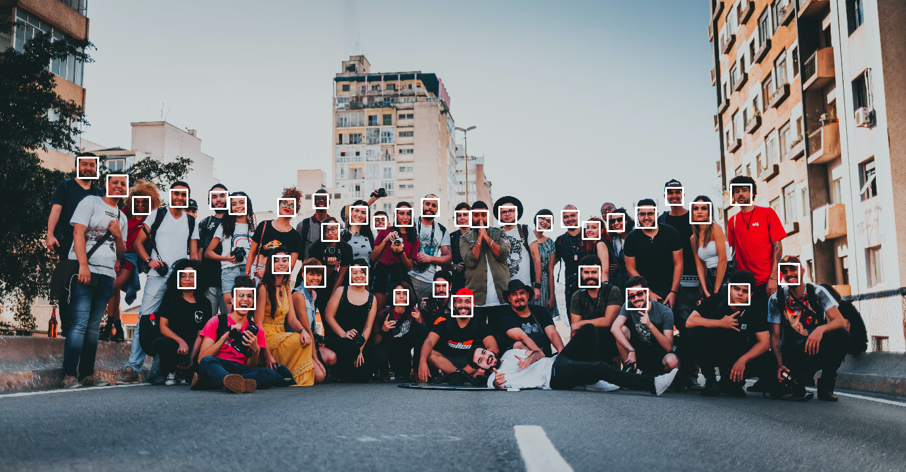
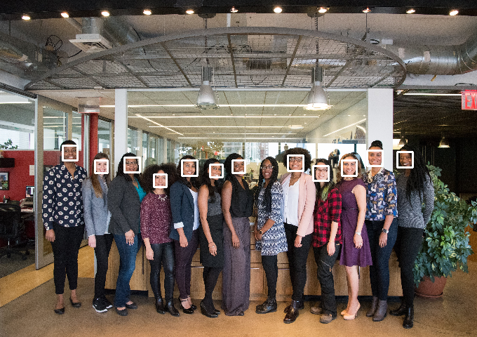
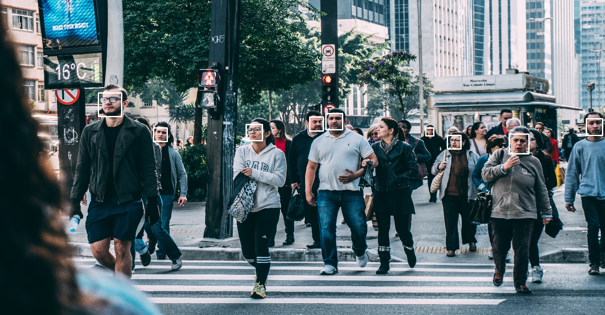
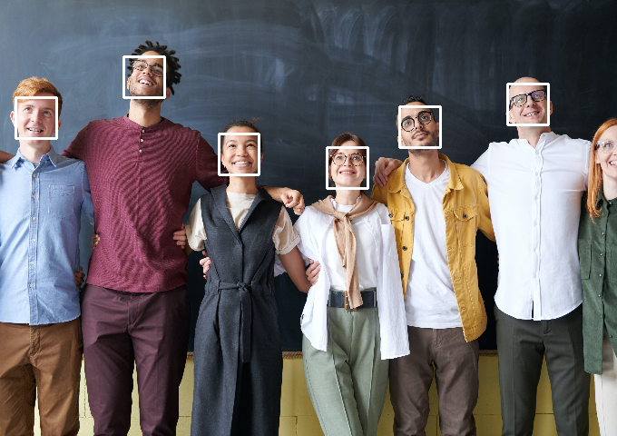
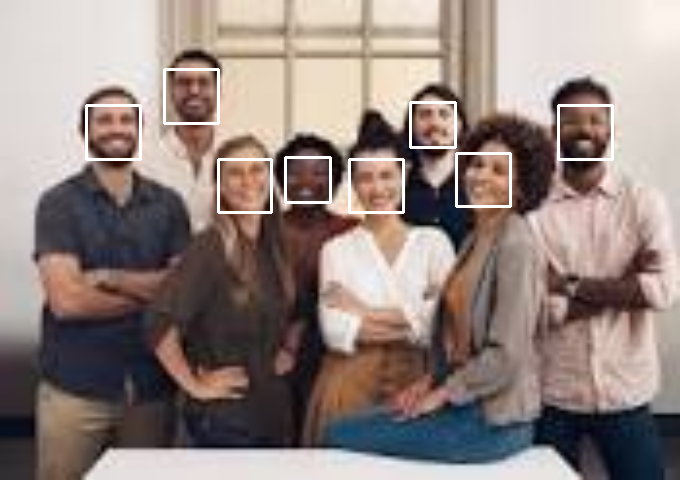
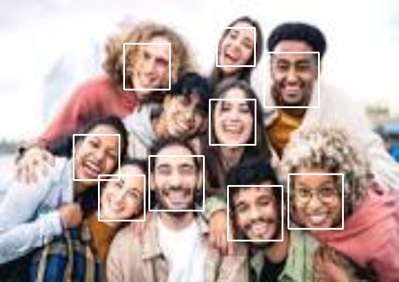

# HOG-Based Face Detection with dlib
## Overview
This repository contains a Python script for face detection using the dlib library with the Histogram of Oriented Gradients (HOG) technique. The script is designed to work with both images and videos, providing a flexible solution for face detection tasks.

## Features
HOG-Based Face Detection:

 Utilizes the HOG + SVM face detection algorithm provided by dlib.

**Image Detection:** 
Detect faces in images and save the results.

the output of blur image. very well!

**Video Detection**:Perform real-time face detection in videos and save the processed video.

[output video file](HOG/output/hog_face_detection_video.mp4)

## Requirements
    Python 3.x
    OpenCV
    dlib
    (Additional dependencies as needed)

## Usage
**HOG-Based Face Detection for Image**

    bash
    Copy code
    python hog_image_detection.py -i path/to/your/image.jpg

**HOG-Based Face Detection for Video**

    bash
    Copy code
    python hog_video_detection.py -v path/to/your/video.mp4

**Parameters**

    -i, --image: Path to the input image file.
    -v, --video: Path to the input video file.

**Output**

Detected faces will be highlighted with bounding boxes.
Processed images and videos will be saved in the current working directory.

**Dependencies**

    OpenCV
    dlib
    Notes:
    Make sure to install the required dependencies before running the scripts.
    Adjust file paths and names as needed.
