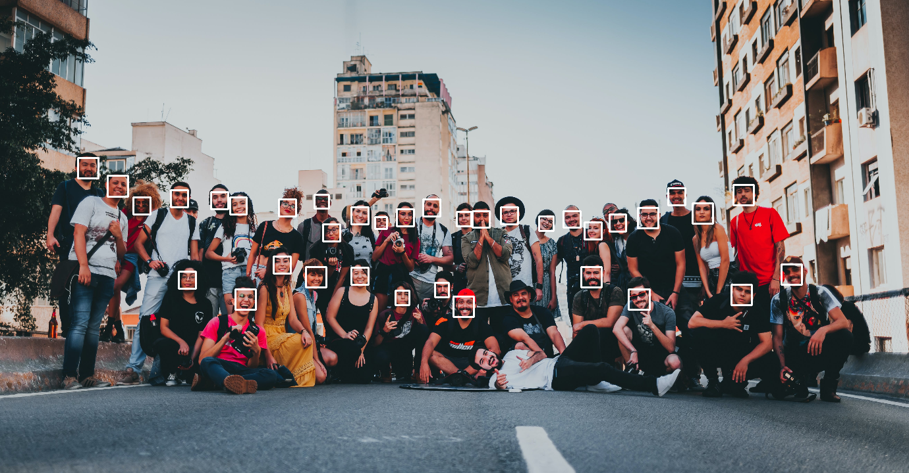

# Object Detection Project

## Overview
This project focuses on the study and implementation of various object detection techniques. It covers a wide range of objects including faces, vehicles, and more. Different methods are employed to achieve accurate and efficient detection.

## Techniques Used
The following object detection techniques have been explored in this project:

### 1. Face Detection
- Description:
    Face detection is a crucial component in many applications. This technique involves locating and identifying human faces within an image or video stream.

 - #### Face Detection with dlib
    This project contains Python scripts for face detection using the dlib library with two 
    
    different techniques: Histogram of Oriented Gradients (HOG) and Convolutional Neural Network (CNN). 
    
    The scripts are designed to work with both images and videos, providing a flexible solution for face detection tasks.

The face detection scripts in this project leverage two distinct techniques for accurate and efficient face detection:

1. **Histogram of Oriented Gradients (HOG)**
   - Utilizes the HOG + SVM face detection algorithm provided by dlib.
   - Well-suited for real-time face detection in images and videos.
   - Provides a good balance between accuracy and speed.

   #### output
    - image

    

    - video

    

2. **Convolutional Neural Network (CNN)**
   - Uses the dlib CNN face detection model for improved accuracy.
   - Particularly effective when high accuracy is required, but it may be slower than HOG.
   - Suitable for scenarios where precision is crucial, such as image analysis.
   
   #### output
    - image

    

    - video
    
    

- ### Features

    - **HOG-Based Face Detection**: Efficient and real-time face detection using the HOG technique.

    - **CNN-Based Face Detection**: Improved accuracy through the use of a Convolutional Neural Network.

    - **Image Detection**: Detect faces in images and save the results.
    - **Video Detection**: Perform real-time face detection in videos and save the processed video.

### 2. vehicle Detection
- Description: vehicle detection is essential in scenarios like autonomous driving and traffic monitoring. This technique aims to identify and locate vehicles in images or video frames.
- Implementation: 
    ## Techniques Used
    The following vehicle detection techniques have been explored in this project:

    ### 1. YOLO (You Only Look Once)
    - Description: YOLO is a popular real-time object detection system that processes images in a single pass. It is known for its speed and accuracy in detecting objects, including vehicles.
    - Implementation: [YOLO vehicle Detection Code](./vehicle__detection_yolo/main.py)

    
        - ### result

        

    ### 2. Haar Cascade Classifier
    - Description: Haar Cascade Classifier is a machine learning object detection method used to identify objects in images or video streams. It can be trained to detect specific objects, including vehicles.
    - Implementation: [Code](vehicle_detection_Haar%20Cascade%20Classifier/Car_detection.py)

        - ### result
            

<!-- Add more techniques and implementations as needed -->
