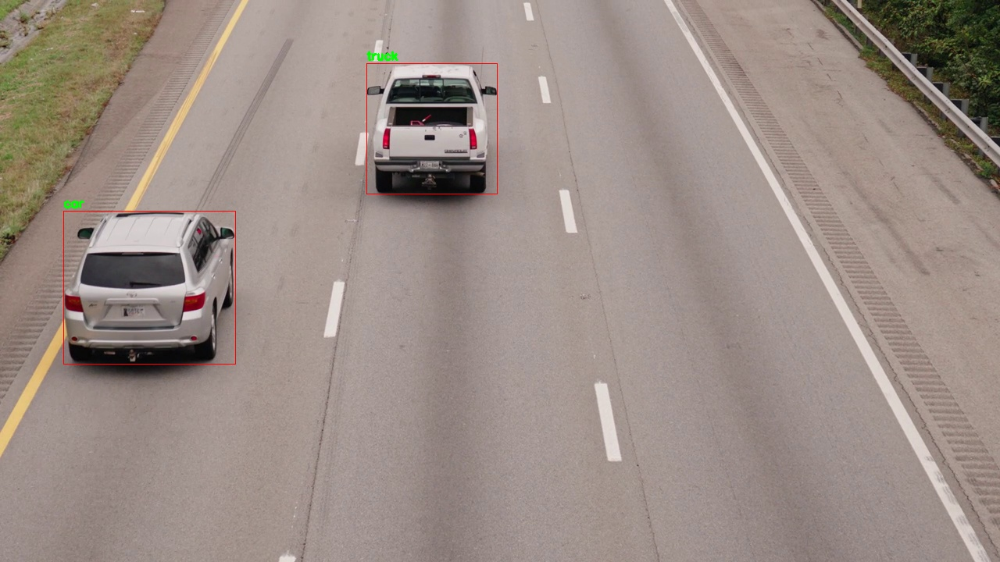
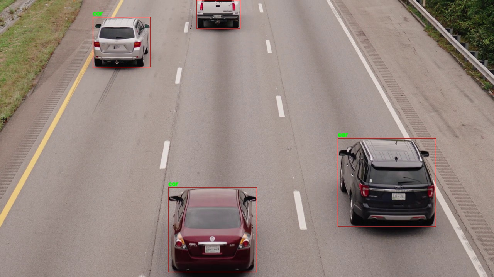
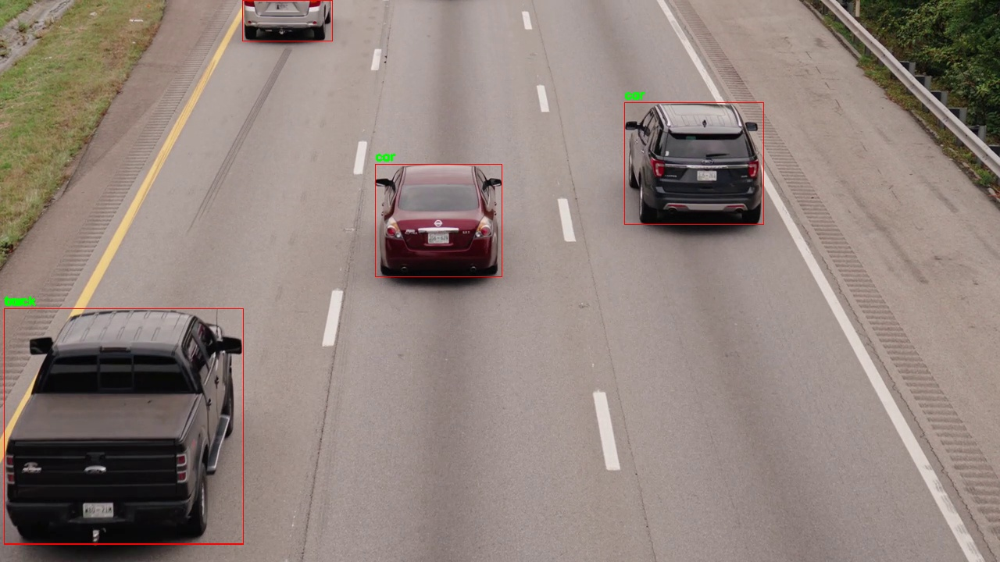

# YOLOv8 Vehicle Detection

This project utilizes YOLOv8 for real-time vehicle detection in a video file. The detected vehicles are annotated and saved as individual frames in the 'output_frames' folder. Additionally, the processed video with annotated frames is saved as 'output_video.mp4'.

## Prerequisites
- Python 3
- OpenCV 
- Ultralytics
- Pytorch
- Numpy
- Pandas

## Usage
1. Ensure the input video file is named `input_video.mp4` and is in the project directory.

3. Run `main.py` to perform object detection on the video.

## File Tree
├── main.py

├── output_frames/

├── output_video.mp4

## output_frames

## output_video
[output_video.mp4](assets/output_video.mp4) - Click the link to view or download the video.

