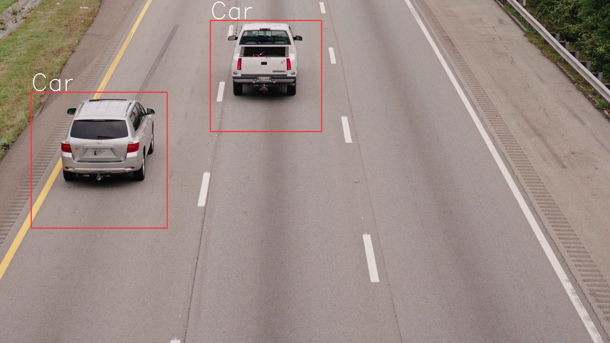
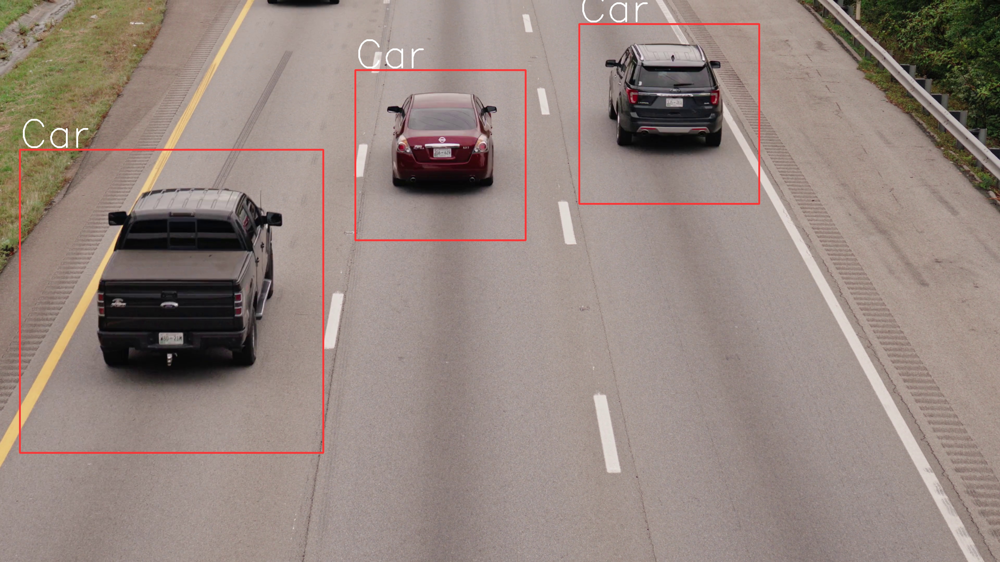

## How to Use

To utilize the object detection techniques implemented in this project, follow these steps:

1. Clone the repository to your local machine.
   ```bash
   git clone https://github.com/morganm94/Object-Detection.git
    cd Object-Detection
    run car_detction.py
   ```

## result





